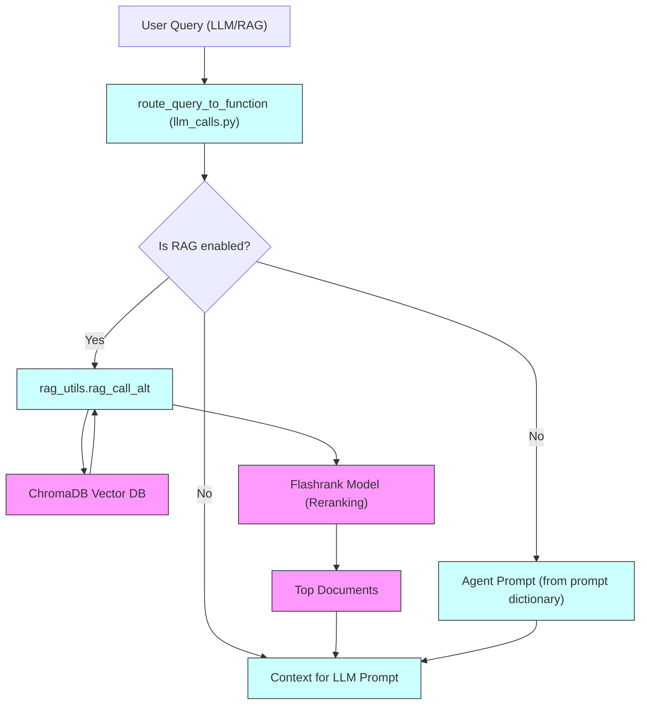
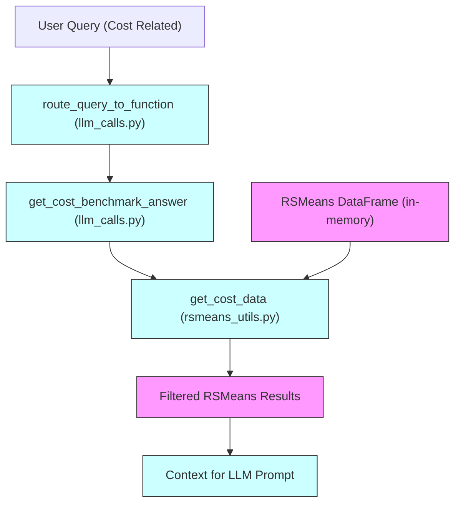
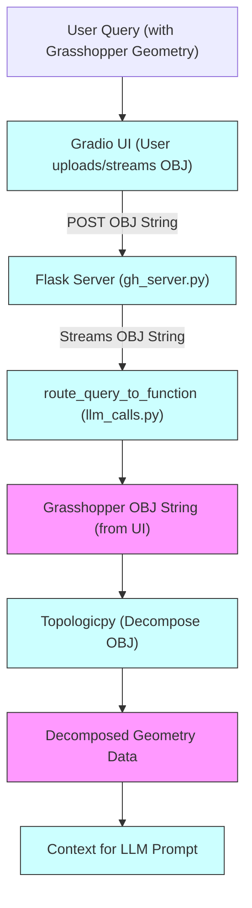
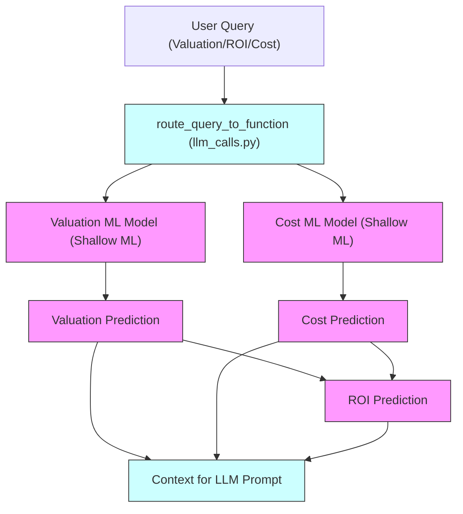
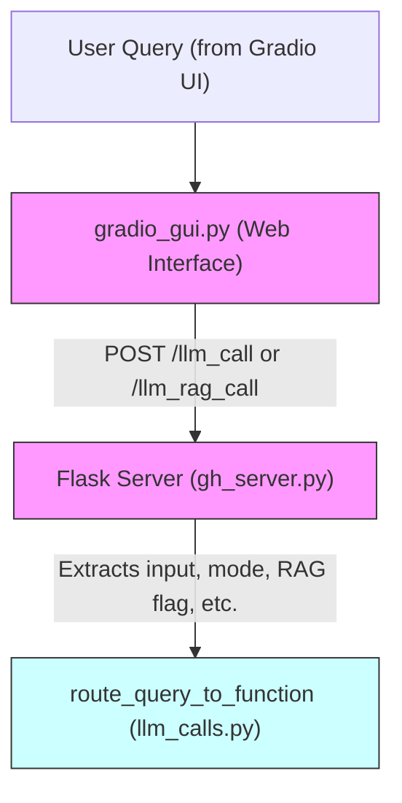
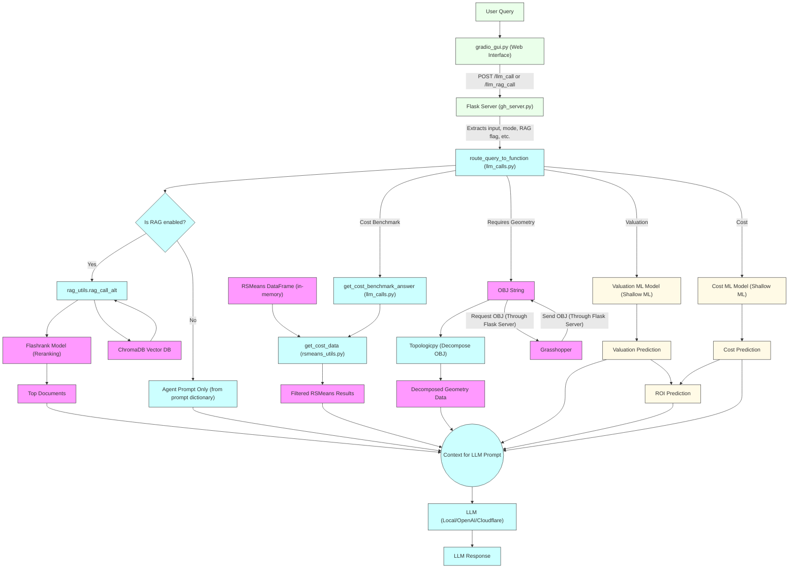

# Project Architecture: LLM/RAG System with Gradio and Flask

This project provides an interactive interface for querying Large Language Models (LLMs) and Retrieval-Augmented Generation (RAG) pipelines, supporting multiple backends (local, OpenAI, Cloudflare). The system is composed of a Gradio UI, a Flask server, and modular backend logic for LLM and RAG calls.

## 1. User Query Flow: From Gradio UI to LLM Response

### Step 1: User Interaction via Gradio UI (`gradio_gui.py`)
- The user enters a question in the Gradio web interface.
- The UI allows selection of:
  - LLM mode (local, OpenAI, Cloudflare)
  - RAG mode (LLM only, LLM + RAG)
  - Response mode (Standard, Streaming)
  - Max tokens for the LLM response
  - (If Cloudflare) specific generation and embedding models
- On submission, the UI sends the query and selected options to the backend Flask server via HTTP POST.

### Step 2: Flask Server Receives the Query (`gh_server.py`)
- The Flask server exposes endpoints:
  - `/llm_call` for standard LLM queries
  - `/llm_rag_call` for RAG-augmented queries
- The server receives the POST request, extracts the user input, mode, RAG flag, streaming flag, and max_tokens.
- If streaming is enabled, the server streams the LLM output back to the UI as it is generated.

### Step 3: Routing and Processing the Query (`llm_calls.py`)
- The Flask server calls `route_query_to_function`, which:
  - Classifies the query type (cost, ROI, value engineering, etc.)
  - Selects the appropriate prompt and processing function
  - If RAG is enabled, retrieves relevant documents using ChromaDB and reranks them
  - Calls the LLM (local, OpenAI, or Cloudflare) with the constructed prompt and context
  - Supports the `max_tokens` parameter to control output length
- The response (and sources, if RAG) is returned to the Flask server.

### Step 4: Returning the Response to the UI
- The Flask server packages the LLM (and RAG) response as JSON (or as a stream if streaming is enabled)
- The Gradio UI receives the response and displays it to the user, along with any source citations if RAG was used.

## 2. Backend Modes and Model Selection
- The backend mode (local, OpenAI, Cloudflare) is managed in `server/config.py`.
- The mode can be changed from the UI, which updates the backend via the `/set_mode` endpoint.
- Model selection (for Cloudflare) is also supported and propagated to the backend.

## 3. RAG Pipeline (`utils/rag_utils.py`)
- When RAG is enabled, the system:
  - Retrieves relevant documents from a ChromaDB vector store
  - Reranks results using a Flashrank model
  - Constructs a prompt with the top documents for the LLM

## 4. Subprocess Management
- The Gradio UI starts the Flask server as a subprocess if it is not already running.
- Output from the Flask server is streamed to the main console for debugging.

## 5. Error Handling and Robustness
- The system includes error handling for API failures, rate limits, and misconfiguration.
- The UI and backend provide informative error messages for troubleshooting.

## 6. Extensibility
- New LLM backends or RAG strategies can be added by extending the routing and configuration logic.
- Prompts and query classification can be customized in `llm_calls.py`.
- Because the GUI is built around Flask, Gradio can easily be replaced with another web framework if needed.

## 7. Rhino Grasshopper Integration
- The system can be integrated with Rhino Grasshopper for architectural and engineering applications.
- The Grasshopper Mesh is saved as an OBJ file, which can be streamed to the Flask server as a string.
- An Obj string can be passed to the Flask server, which can then be processed to generate relevant LLM queries.
- Topologicpy will be used to decompose the Obj string into its components, which can then be used to generate context for the LLM.

## 8. Shallow ML Integration
- The system will support shallow machine learning models for cost and value prediction.
- These models can be integrated into the LLM/RAG pipeline to enhance query responses with predictive analytics.
- These models can also feed into ROI calculations and other financial metrics.

## 9. RSMeans Data Integration (`rsmeans_utils.py`)
- The system integrates RSMeans construction cost data to provide accurate, industry-standard cost benchmarks for user queries.
- RSMeans data is loaded at server startup and stored as a DataFrame for efficient querying.
- When a user submits a cost benchmark question (e.g., "What is the typical cost per sqft for concrete?"), the backend attempts to match the query to relevant RSMeans entries using both code and description matching.
- If relevant RSMeans data is found, a summary table is generated and included in the LLM prompt, allowing the model to reference real cost data in its response.
- The LLM then produces a concise explanation or interpretation of the data, including any assumptions (such as location, year, or unit).
- If no RSMeans data is found, the system falls back to a standard LLM-only response.
- This integration ensures that cost-related answers are grounded in up-to-date, authoritative construction cost information, improving reliability and transparency for users.

## 10. MasterFormat Code Usage
- The MasterFormat code is a standardized classification system for organizing construction materials, products, and activities.
- In this system, MasterFormat codes are used to map user queries to the correct RSMeans cost data:
  - If a user provides a MasterFormat code (e.g., "03 30 00" for cast-in-place concrete), the backend retrieves all RSMeans entries for that code.
  - If the user provides a description (e.g., "concrete slab"), the system uses an LLM to select the most appropriate MasterFormat code from the available list, then retrieves the corresponding cost data.
- This ensures that cost benchmarks and estimates are based on industry-standard categories, improving accuracy and transparency.
- The selected MasterFormat code and its description are included in the LLM prompt, so the model's response is clearly tied to the relevant construction activity or material.
- By grounding answers in MasterFormat-coded data, the system provides reliable, traceable, and context-specific cost information for construction queries.

---

**Summary:**
This project provides a modular, extensible platform for LLM and RAG-based question answering, with a user-friendly Gradio interface, robust backend routing, and support for multiple LLM providers and advanced retrieval techniques.

---

**Diagram**

**RAG Pipeline Overview**



This diagram shows how the `rag_utils` module enables Retrieval-Augmented Generation (RAG) in the system, including document retrieval, reranking, and prompt construction for the LLM.


--- 

**RSMeans Data Utility Overview**



This diagram shows how the `rsmeans_utils` module is used in the cost benchmark flow: starting from the user prompt, through the routing and answer functions, to data filtering and LLM prompt construction.

---

**Prompt Types in the System**

The system uses a prompt dictionary to route queries to the appropriate LLM prompt template. The main prompt types are:

- **analyze cost tradeoffs**: For comparing cost, longevity, and ROI impacts of different materials or design choices.
- **analyze roi sensitivity**: For evaluating how changes in construction cost, rent, or occupancy affect ROI, with scenario-based sensitivity analysis.
- **get cost benchmarks**: For providing standard cost per sqft values or material unit prices from industry data, tailored to context if given.
- **suggest cost optimizations**: For suggesting practical ways to reduce project costs while maintaining design intent (value engineering).
- **analyze project data inputs**: For extracting cost-related insights from project data (e.g., IFC/CSV), such as concrete volume cost or unit type ratios.

Each prompt type is selected based on the classified query type and is used to build the system prompt for the LLM.

---

**Grasshopper Geometry Integration Overview**



This diagram shows how the Gradio UI uploads/streams the OBJ string to the Flask server, which then streams it to the routing function and downstream processing.

---

**Valuation ML Integration Overview**



This diagram shows how the Valuation ML model is integrated: starting from the user prompt and routing, through the ML model, to context construction for the LLM.

---

**Gradio UI Integration Overview**



This diagram shows how the Gradio UI is integrated: starting from the user prompt, through the web interface, to the Flask server and routing function, ending with context construction for the LLM.

---

**Comprehensive System Overview**



This comprehensive diagram illustrates the full system flow, integrating all components and processes from user input through to the LLM response, including UI interactions, Flask routing, RAG processing, RSMeans data integration, Grasshopper OBJ handling, shallow ML model predictions, and final LLM prompt context construction.

**Legend for Diagram Node Styles:**

- <span style="background-color:#eaffea; border:1px solid #333; padding:2px 6px;">User/UI</span>: User input, web interface, and server endpoints (light green)
- <span style="background-color:#cff; border:1px solid #333; padding:2px 6px;">Process/Logic</span>: Processing steps, routing, and prompt/context construction (light blue)
- <span style="background-color:#f9f; border:1px solid #333; padding:2px 6px;">Data Source</span>: Databases, dataframes, and document stores (light magenta)
- <span style="background-color:#fffae6; border:1px solid #333; padding:2px 6px;">ML Model</span>: Machine learning models and their outputs (light yellow)

**Pseudocode for Comprehensive System Overview**

```
// User/UI Interaction
User submits query via Gradio UI
    if geometry is needed:
        User uploads OBJ string
    User selects LLM mode, RAG mode, etc.
    Gradio UI sends POST to Flask server (/llm_call or /llm_rag_call)

// Flask Server
Flask receives request
    Extract input, mode, RAG flag, etc.
    Call route_query_to_function

// Query Routing and Processing
route_query_to_function:
    Classify query type (cost, ROI, value engineering, etc.)
    if RAG enabled:
        Call rag_utils.rag_call_alt
        Retrieve documents from ChromaDB
        Rerank with Flashrank model
        Select top documents
        Add to LLM prompt context
    if cost benchmark required:
        Call get_cost_benchmark_answer
        Call get_cost_data (rsmeans_utils)
        Filter RSMeans DataFrame
        Add summary table to LLM prompt
    if geometry required:
        Receive OBJ string
        Decompose with Topologicpy
        Add geometry context to LLM prompt
    if ML prediction required:
        Call Valuation ML and/or Cost ML
        Get predictions (valuation, cost, ROI)
        Add results to LLM prompt
    Build final prompt for LLM

// LLM Call
Call selected LLM backend (local/OpenAI/Cloudflare)
    Send prompt and context
    Receive LLM response

// Return to UI
Flask returns response to Gradio UI
    Include LLM output, sources, tables, predictions
Gradio UI displays response to user
    Show answer, sources, additional data

